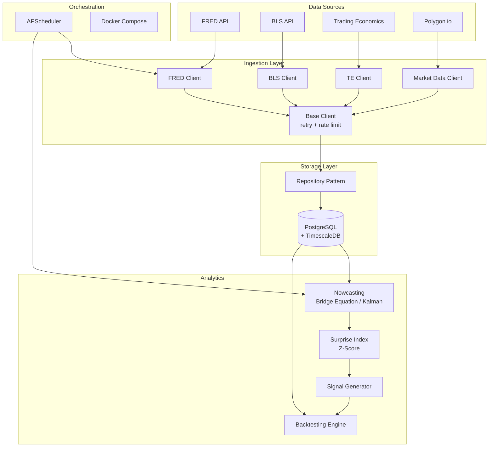

# Macro Quant Trading System

A modular, event-driven macro quantitative trading system built in Python. Ingests macroeconomic data (CPI, NFP, GDP, PCE, etc.), nowcasts upcoming releases, detects consensus surprises, and backtests trading strategies around data releases.

## Architecture



## Quick Start

### Prerequisites

- **Python 3.11+**
- **Docker** and **Docker Compose** (for PostgreSQL + TimescaleDB)
- **uv** package manager ([install](https://docs.astral.sh/uv/getting-started/installation/))

### 1. Clone and configure

```bash
# Copy environment template
cp .env.example .env

# Edit .env and fill in your API keys:
# - FRED_API_KEY (required): https://fred.stlouisfed.org/docs/api/api_key.html
# - BLS_API_KEY (optional): https://data.bls.gov/registrationEngine/
# - POLYGON_API_KEY (required): https://polygon.io/dashboard/signup
# - TRADING_ECONOMICS_API_KEY (optional): https://tradingeconomics.com/analytics/api.aspx
```

### 2. Start the database

```bash
docker-compose up -d db
```

### 3. Install dependencies

```bash
# Install uv if you haven't already
# Windows: powershell -c "irm https://astral.sh/uv/install.ps1 | iex"
# Linux/Mac: curl -LsSf https://astral.sh/uv/install.sh | sh

# Install all dependencies (including dev)
uv sync --all-extras
```

### 4. Run database migrations

```bash
uv run alembic upgrade head
```

### 5. Run tests

```bash
# Run all tests
uv run pytest tests/ -v

# Run with coverage report
uv run pytest tests/ -v --cov=src --cov-report=term-missing

# Run only unit tests (skip integration tests requiring Docker DB)
uv run pytest tests/ -v -m "not integration"
```

### 6. Full Docker deployment

```bash
# Build and start all services
docker-compose up -d

# Run migrations
docker-compose run --rm migrate

# Check logs
docker-compose logs -f app
```

## Project Structure

```
macro-quant/
├── src/
│   ├── config.py                    # Pydantic settings (env vars)
│   ├── data_ingestion/
│   │   ├── base_client.py           # Abstract base: retry, rate limit, errors
│   │   ├── fred_client.py           # FRED API (CPI, NFP, GDP series)
│   │   ├── bls_client.py            # BLS API (official releases)
│   │   ├── trading_economics_client.py  # Economic calendar + consensus
│   │   ├── market_data_client.py    # Polygon.io (OHLCV, snapshots)
│   │   └── schemas.py              # Pydantic v2 data models
│   ├── storage/
│   │   ├── models.py               # SQLAlchemy 2.0 ORM models
│   │   ├── database.py             # Async engine + session management
│   │   └── repository.py           # Repository pattern (no raw SQL leak)
│   ├── models/
│   │   └── nowcast/                # Nowcasting models (Phase 3)
│   ├── backtesting/                # Backtesting engine (Phase 4)
│   ├── signals/                    # Signal generation (Phase 5)
│   ├── risk/                       # Position sizing (Phase 5)
│   └── scheduler/                  # Job orchestration (Phase 6)
├── tests/                          # pytest test suite
├── alembic/                        # Database migrations
├── notebooks/                      # Jupyter exploration (not production)
├── docker-compose.yml
├── Dockerfile
├── .env.example
└── pyproject.toml
```

## Key Design Decisions

| Decision | Rationale |
|----------|-----------|
| **uv** over Poetry | 10-100x faster resolution, native workspace support, single binary |
| **httpx** (async) | Connection pooling, HTTP/2, async-native |
| **Pydantic v2** | All data validated at boundaries, not just dicts |
| **TimescaleDB** | Automatic time partitioning for OHLCV data at scale |
| **Repository pattern** | No raw SQL in business logic, testable with SQLite |
| **Token bucket rate limiter** | Per-provider rate limits, not global |
| **structlog** | Structured JSON logs, not print() |
| **ON CONFLICT upserts** | Idempotent data ingestion (scheduler safe to re-run) |

## API Key Reference

| Provider | Purpose | Free Tier | Link |
|----------|---------|-----------|------|
| FRED | Historical macro data | ✅ Unlimited | [Get key](https://fred.stlouisfed.org/docs/api/api_key.html) |
| BLS | Official CPI/NFP releases | ✅ 500 req/day | [Register](https://data.bls.gov/registrationEngine/) |
| Polygon.io | Market price data | ✅ 5 req/min | [Sign up](https://polygon.io/dashboard/signup) |
| Trading Economics | Calendar + consensus | ⚠️ 50 req/day | [API access](https://tradingeconomics.com/analytics/api.aspx) |

## Development

```bash
# Lint
uv run ruff check src/ tests/

# Type check
uv run mypy src/

# Format
uv run ruff format src/ tests/
```

## Roadmap

- [x] **Phase 1**: Data Ingestion Layer (FRED, BLS, TE, Polygon clients)
- [x] **Phase 2**: Storage Layer (PostgreSQL + TimescaleDB, Repository pattern)
- [ ] **Phase 3**: Nowcasting Models (bridge equation, Kalman filter, surprise index)
- [ ] **Phase 4**: Backtesting Engine (event-driven, transaction costs, metrics)
- [ ] **Phase 5**: Signal Generation & Risk Management
- [ ] **Phase 6**: Orchestration & Dashboard

## License

MIT
